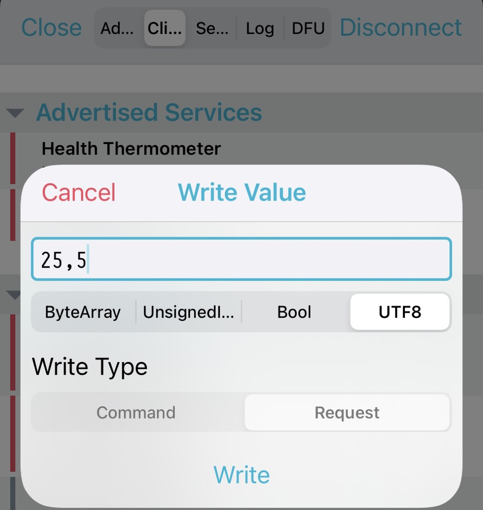

# micro:bit Pomodoro Timer


A micro:bit based [Pomodoro](https://en.wikipedia.org/wiki/Pomodoro_Technique) 🍅 timer built with [Embassy](https://github.com/embassy-rs/embassy) and Nordic SoftDevice.

### Features:

* BLE services
	* Timer configuration via BLE
* Use of internal Flash Storage to retain timer configs
* LED matrix display
* Buzzer

## Requirements

### probe-rs

Install probe-run

```
cargo install probe-run
```

### Board

[micro:bit v2](https://microbit.org/new-microbit/).


## How to run the app

### 1. Install SoftDevice

SoftDevice needs to be flashed first. You only need to do this once. (If you do a full erase, flash it again.)

#### 1.1 Erase the chip

`probe-rs-cli erase --chip nRF52833_xxAA`

#### 1.2 Flash softdevice

`probe-rs-cli download --chip nRF52833_xxAA --format hex s140_nrf52_7.3.0/s140_nrf52_7.3.0_softdevice.hex`

### 2. Run

`cargo run --release`

The app starts and waits for one of two possible actions: 

* Press Button B -> Start a pre-defined timer
* Send a new timer config via BLE -> Write the config to flash and start a timer.


#### Start a pre-defined timer

Hit button B and start the pre-defined timer saved in the flash (or a default timer if there is none.). The default timer is 25 mins of work and 5 mins of rest.

#### Program a new timer

Use an app like [nRF Connect app](https://www.nordicsemi.com/Products/Development-tools/nrf-connect-for-mobile) and connect to the device that advertises its BLE name as "Pomodoro!". When a connection is established, look for a characteristic whose UUID is `11111111-1111-1111-1111-111111111111`. Choose the "Write" option and send a UTF8 string to the device. The valid format is "work_timer,rest_timer". Express work_timer and rest_timer in minutes.

Examples:

* 25,5 -> 25 mins of work and 5 mins of rest
* 20,10 -> 20 mins of work and 10 mins of rest



Upon receiving a string, the app writes the data to the nRF52833's internal flash and starts the timer. If the provided string is invalid, the app emits an error sound. You can resend a string or press button B and start a timer.

#### Pause a work timer

You can press Button A and pause a timer in the `work` state. Press Button A again to restart the timer. 

### Credits

The implementation of LED display is mostly from [microbit-async](https://github.com/lulf/microbit-async) project.
